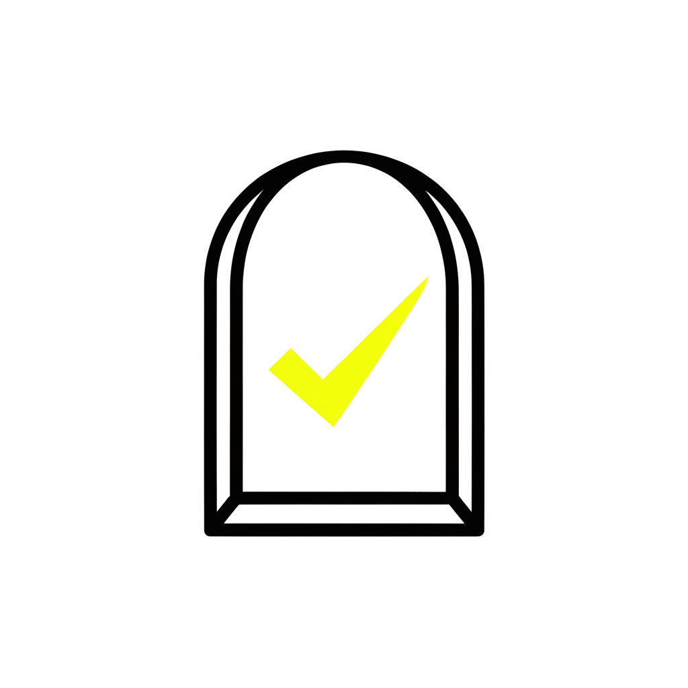
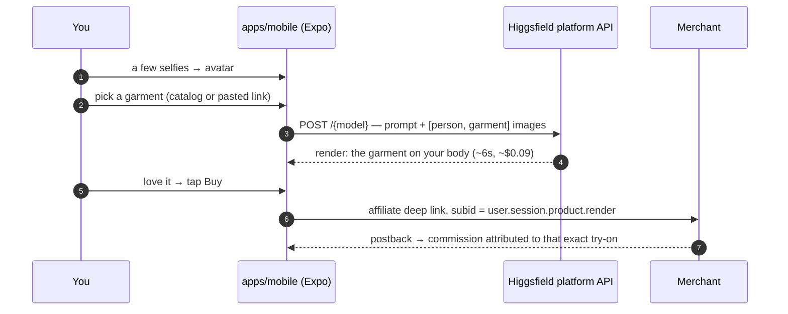

<div align="center">



# FitCheck

**See it on you before you buy it.**

A few selfies become your photoreal avatar. Any garment renders on *your* body in seconds.
Love it? One tap opens the store. Merchants pay the commission — you never pay FitCheck anything.

[**▶ Try the live app — right in your browser, nothing to install**](https://try-fitcheck.vercel.app)

[](https://try-fitcheck.vercel.app)
[](https://github.com/Mukhsin0508/FitCheck/stargazers)
[](LICENSE)
[](apps/mobile)
[](apps/landing)
[](tsconfig.base.json)
[](CONTRIBUTING.md)


*Garment on the left, that garment on the avatar next to it. Every image in this repo was generated with [Higgsfield Soul](https://higgsfield.ai).*

</div>

---

## Try it in 10 seconds

The full app runs **inside the landing page** — an Expo web build in an iPhone frame at
[try-fitcheck.vercel.app](https://try-fitcheck.vercel.app). Set up the demo avatar, browse
352 pieces, try them on, save fits, build a share card. No clone, no install, no API key.

To run it as a real native app with live AI renders, see [Run it](#run-it).

## Why this exists

Try-on tech and affiliate commerce both work; nobody has closed the loop between them at
scale. Doji raised $14M and has no purchase flow. Google Doppl has no monetization.
Whering has 10M users and no photoreal try-on. FitCheck's whole product is the loop:
**try-on → want it → tracked checkout**.

The unit economics carry it:

| | |
|---|---|
| Cost per try-on render | **$0.04–0.09** (FASHN $0.075 · Kling $0.07 · Higgsfield ≈ $0.09) |
| Expected commission per try-on session | **$0.24–0.75** (AOV $80–115 × 8–16% commission × 2.4% baseline conversion, lifted 27–94% by try-on per Shopify/Google studies) |
| Margin per session | **3–10×**, before the ~26% apparel-return haircut |

So the engineering follows the economics: cap free renders, cache aggressively (same
avatar + same garment = same render, $0.00), log the cost of every render, and prioritize
affiliate programs with 30-day cookies and 10%+ commissions over weak rails like Amazon
Fashion's 4%/24h.

## How the loop works



## What's in the box

```
fitcheck/
├── apps/
│   ├── mobile/       # Expo (React Native) app — the product
│   └── landing/      # Next.js landing page, with the app embedded live
└── packages/
    ├── higgsfield/   # Typed Higgsfield API client (try-on, jobs, uploads, cost accounting)
    ├── tryon/        # Provider-agnostic try-on: Higgsfield ⇄ FASHN ⇄ Kling ⇄ mock
    ├── affiliates/   # Deep links + subid attribution + postback parsing
    └── catalog/      # Normalized product feed (352 items, 4 categories)
```

### `@fitcheck/higgsfield` — the typed API client

Speaks the real Higgsfield **platform API** wire protocol, verified against the official
`@higgsfield/client` v2 SDK and the published OpenAPI schema
([snapshot in `docs/`](docs/higgsfield-openapi.json)):

- Auth is one header: `authorization: Key <KEY_ID:KEY_SECRET>`, plus a custom user-agent
  (the platform WAF rejects default agents).
- A generation is `POST /{model-slug}` with the input as the JSON body; the response is a
  flat `{ request_id, status, images? }` you poll at `GET /requests/{id}/status`.
- Try-on runs on `higgsfield-ai/popcorn/auto` (prod) or `nano-banana-2/image-to-image`
  (dev), contract `{ prompt, image_urls: [person, garment], aspect_ratio }`.
- File uploads go through `POST /files/generate-upload-url`, then a `PUT` with the
  returned `upload_headers` **only** — adding your own content-type breaks the pre-signed
  S3 signature.

```ts
const hf = HiggsfieldClient.create({ credentials: "KEY_ID:KEY_SECRET" });

// The core loop: garment → a photo of the user wearing it
const render = await hf.tryon.renderAndWait({
  personImage: user.avatarUrl,
  garmentImage: product.imageUrl,
  category: "dress",
});

// Billing-grade quote before submitting
const quote = await hf.estimateRemote("higgsfield-ai/popcorn/auto", { prompt });
```

It ships retries with jittered backoff (429/5xx and the account concurrency cap, honoring
`Retry-After`), polling at the documented cadence, an error taxonomy (401 auth, 403
insufficient credits, 422 validation…), per-render cost accounting (`onUsage` +
`estimateRemote`), and a full in-memory mock (`HiggsfieldClient.mock()`) that speaks the
real protocol through the real transport/retry/polling stack, offline.

Three things worth knowing:

- **Keys are environment-bound.** Dev-dashboard keys only authenticate against the dev
  API host; production keys against `platform.higgsfield.ai`. A 401 with a valid key
  usually means the wrong host.
- **Result URLs expire (~7 days).** They're pre-signed CDN links — download or persist
  renders promptly.
- **Keep credentials server-side in production.** Demo mode needs none; the production
  design puts keys behind a thin FitCheck server, never in the shipped app.

### `@fitcheck/tryon` — the provider abstraction

Pick a provider per garment category, fall through on failure, cache renders (the avatar
version is part of the cache key, so a new avatar invalidates everything), and log every
render's cost — cached hits log $0.00.

### `@fitcheck/affiliates` — where the money comes back

One module per network — Awin, Rakuten, CJ, Partnerize, direct — building correct deep
links with a subid that encodes `user.session.product.render`, plus postback parsing that
turns network callbacks into normalized commission events. This is how a purchase gets
attributed back to the try-on that sold it.

### `apps/mobile` — the product

Expo SDK 57 / React Native, expo-router, React Compiler. Onboarding (camera selfies →
avatar), a 352-item catalog across four categories with editorial filters, the try-on
screen with a render theatre, a closet, a share-card generator (side-by-side or 2×2 grid,
watermarked), paste-a-URL try-on, and affiliate click-out. Runs fully offline in demo
mode; add credentials and the same screens do real AI renders.

## Run it

```bash
git clone https://github.com/Mukhsin0508/FitCheck.git
cd FitCheck
npm install

# The app (Expo — press i for the iOS simulator, a for Android)
npm run mobile

# The landing page
npm run landing

# Checks
npm run typecheck
npm test
```

Node ≥ 20. **No env vars needed** — demo mode ships with a full offline provider.

### Real AI renders

Create `apps/mobile/.env` (gitignored) with your Higgsfield platform key:

```bash
EXPO_PUBLIC_HIGGSFIELD_CREDENTIALS=KEY_ID:KEY_SECRET
```

That's it for production keys (`https://platform.higgsfield.ai` is the default host).
Renders cost ~$0.09 and take ~6 seconds; every render logs its cost in the app. If the
API fails for any reason, the app falls back to the demo provider instead of breaking the
flow.

## Privacy, non-negotiable

Selfies exist to build your avatar and for nothing else. In demo mode they never leave
the phone. The production design encrypts user photos, never uses them for training, and
deleting your account purges photos and renders. In the app, "Delete everything on this
phone" removes selfie files from disk and resets the stored identity — not just UI state.

## Roadmap

- [x] Selfies → avatar → try-on render in under 10s → affiliate click-out with a correct per-network subid
- [x] Postback parsing that turns a network callback into an attributed commission event
- [x] Share card with every render; render cost per user logged
- [x] 352 catalog items across 4 categories with validated feed ingestion
- [x] Client speaks the real platform protocol (verified against `@higgsfield/client` v2 and the published OpenAPI schema)
- [x] Live renders verified end to end on-device (~$0.09, ~6s per render)
- [x] The full app playable in the browser on the landing page
- [ ] Thin FitCheck server (keeps API credentials off the device, receives postbacks, rate-limits web renders)
- [ ] Live affiliate program credentials (Awin / Rakuten / CJ / Partnerize accounts)
- [ ] Avatar identity API (Higgsfield Soul ID) when it goes public

## Contributing

Issues and PRs are welcome — [CONTRIBUTING.md](CONTRIBUTING.md) has the short version:
run `npm run typecheck && npm test` before you push, anything touching money
(`packages/affiliates`) needs tests, and copy follows the house style (sentence case,
contractions, no "seamless").

## License

[MIT](LICENSE) © [Mukhsin Mukhtorov](https://github.com/Mukhsin0508)

If FitCheck is useful to you, a ⭐ genuinely helps it get found.
